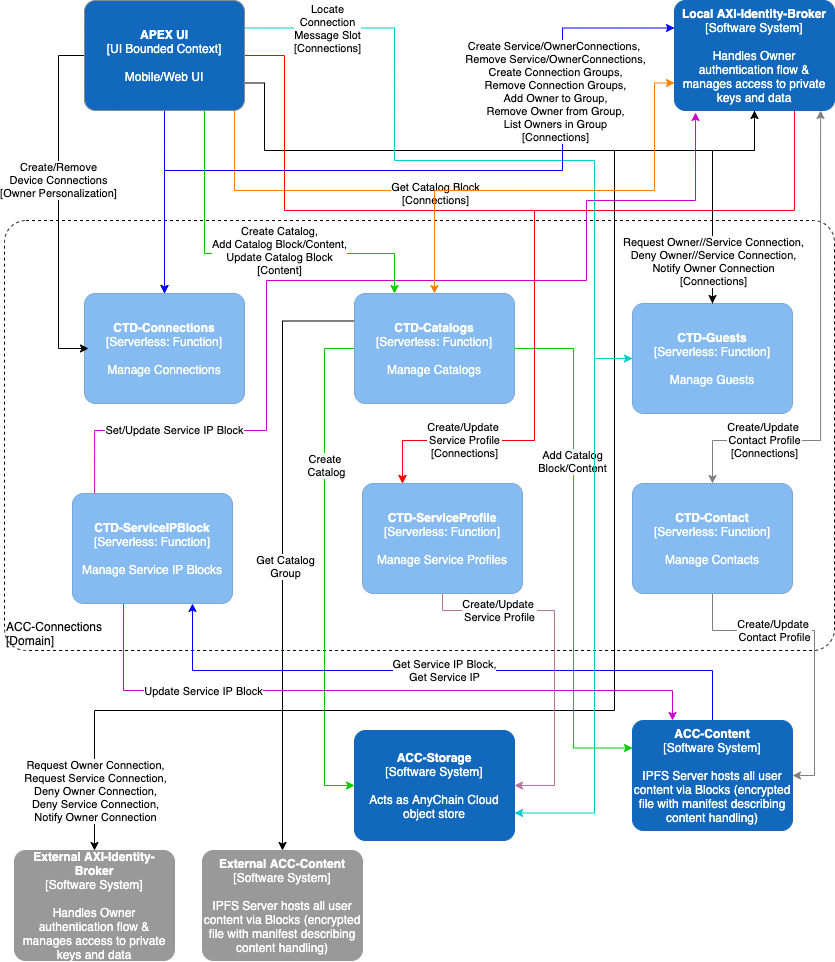

APEX Bounded Contexts & Domains

The AnyChain implementation is based on Domain-Driven Design ([DDD](https://en.wikipedia.org/wiki/Domain-driven_design)) and implemented as a set of serverless design patterns. Our solution is focused purely on the individual functions defined within our structured domain model. The AnyChain mobile or web user interfaces are not monolithic.  Our frontend uses autonomous microapps that are independently deployed. The objective of a micro frontend is to divide the user experience into a set of independent micro applications, while also providing users with a seamless experience. 

DDD defines a separate domain model for each subdomain. A subdomain is a part of the *domain*, DDD’s term for the application’s problem space.

DDD calls the scope of a domain model a *bounded context*. A bounded context includes the code artifacts that implement the model. When using the serverless architecture, each bounded context is a set of self-contained services.

The DDD concept of subdomains and bounded contexts maps nicely as a set of serverless design patterns. Our solution is focused purely on the individual serverless functions defined within our subdomains. Our frontend uses autonomous microapps that are independently deployed. The objective of a micro frontend is to divide the user experience into a set of independent micro applications, while also providing users with a seamless experience. 

APEX UI Bounded Context & Domain

The AnyChain mobile or web user interface is not monolithic. The frontend is to be implemented using autonomous microapps that are independently deployed. The objective of a micro frontend is to divide the user experience into a set of independent micro applications, while also providing users with a seamless experience. The main entry point will act as a metadata-driven assembly and menu system. This approach breaks the presentation tier into a set of independently deployable micro applications but stitches them back together for a seamless UX. As users move between different activities, it will not feel like they are jumping between applications. It feels like a single application.

The **_APEX Universal Wallet_** (**_Au Wallet_**) is the standard AnyChain microapps implementation and the Owner’s primary interface to APEX.  It is a mobile application with built-in core functionality for creating an APEX account, authenticating an Owner as required and securing/backing up critical private keys/data. The Au Wallet also supports microapps that may be dynamically added as required to support desired functionality. Examples of microapps include an Owner’s feed, content creation, owner 

APEX Identity (AXI) Bounded Contexts

The APEX Identity (AXI) Bounded Context contains these Domains:

* AXI-Identity Broker

* AXI-Persistent Storage

* AXI-Owner Events

AXI-Identity Broker Domain

AXI only supports a single Owner and binds to their mobile device. AXI becomes the Owner’s proxy online by performing all actions on the Owner’s behalf at their direction.

AXI-Persistent Storage Domain

AXI Persistent Storage is where all of an Owner’s important data is stored besides their private keys and other protected data contained in their Protean Credential. The primary goal here is to provide a secure key value storage location under the Owner’s control. 

AXI-Owner Events Domain

AXI Owner Events revolves around the Owner’s Queue of events and how those events are processed and managed. These events encompass activities that require automation (e.g. process a subscription), drive Owner behavior (e.g. specify microapps for the UI) and provide content for the Owner to engage with (e.g. audio, video, messages, etc.).

AnyChain (ACC) Bounded Contexts

The AnyChain Cloud (ACC) contains these Bounded Contexts and Domains:

* Cloud

    * ACC-Admin

    * ACC-Auth

    * ACC-Connections

    * ACC-Content

    * ACC-External Services

    * ACC-GuestBook

    * ACC-Vault

    * ACC-Wallet

* Storage

    * ACC-Storage

* Guides

    * ACC-Composer

ACC-Admin Domain

ACC-Admin is focused on Owner and cloud administration. This is where ACC is configured and admins/Owners can personalize their environments.

ACC-Auth

ACC-Auth is used to enroll and authenticate Owners. This domain creates the Protean Credentials Owners used to access their APEX environment.

ACC-Connections

ACC-Connections is how Owners connect with others and manage those connections through their lifecycle (e.g. key rotations).

ACC-Content

ACC-Content supports organizing and sharing content with an Owner’s connections. This domain packages content into Blocks (encrypted archives) that are shared over IPFS.

ACC-External Services

ACC-External Services is where serverless functions representing APIs for an external blockchain or service are found. This domain is how blockchain activities like sending or receiving value are integrated into APEX. These serverless functions will require supporting infrastructure like blockchain nodes which should be deployed in the ACC environment. 

ACC-GuestBook

ACC-Guestbook is designed for controlling access to public profiles, supporting Owner discovery and logging visitor activity.

ACC-Vault

ACC-Vault provides secure encrypted storage of Owners important credential data (e.g. private keys for wallets). It is a backup service where only authorized Owners can recover their keys.

ACC-Wallet

ACC-Wallet controls payment activities on an Owner’s behalf. Owners may create wallets for supported blockchains and ACC-Wallet enables automation (e.g. subscription processing) as desired.

ACC-Storage

ACC-Storage manages object storage for Owners while sharing desired Blocks over IPFS.

ACC-Composer

ACC-Composer is where serverless functions and blueprints become APEX activities and guides. It is also how APEX may be extended to support additional external systems.

