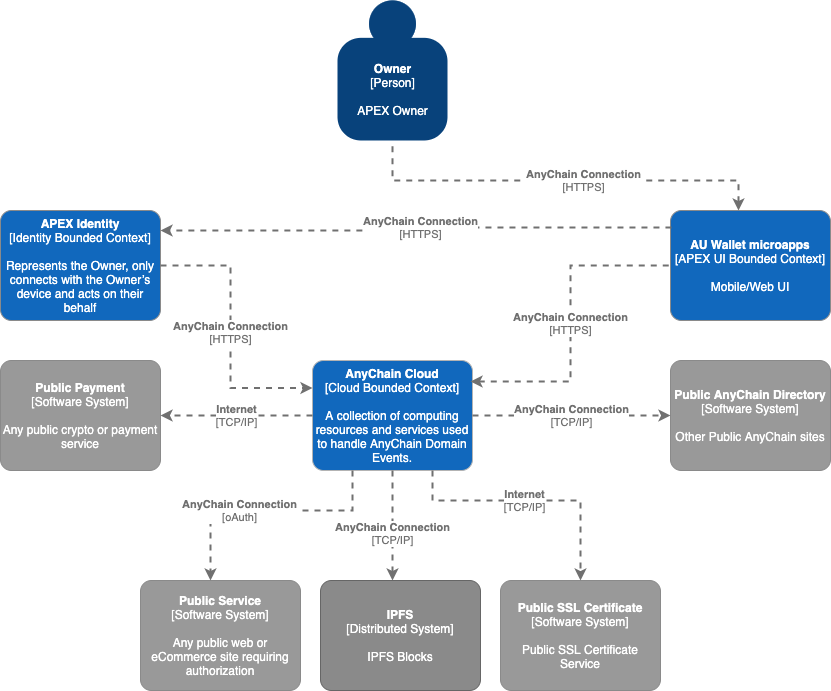
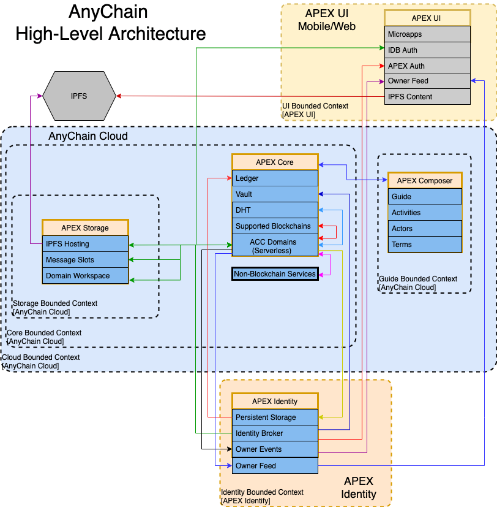
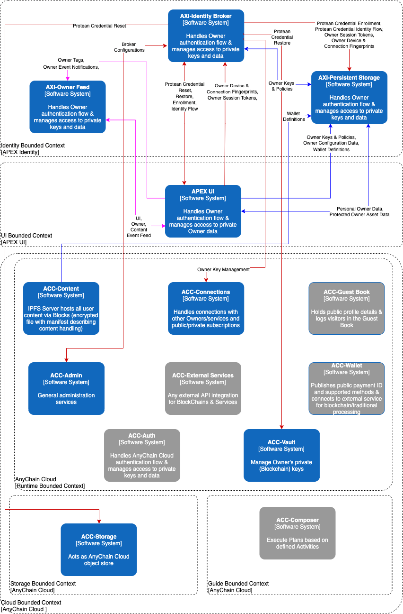
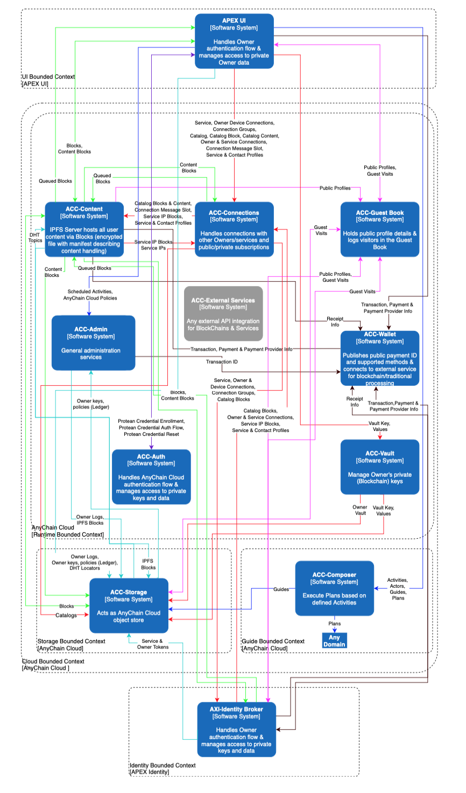
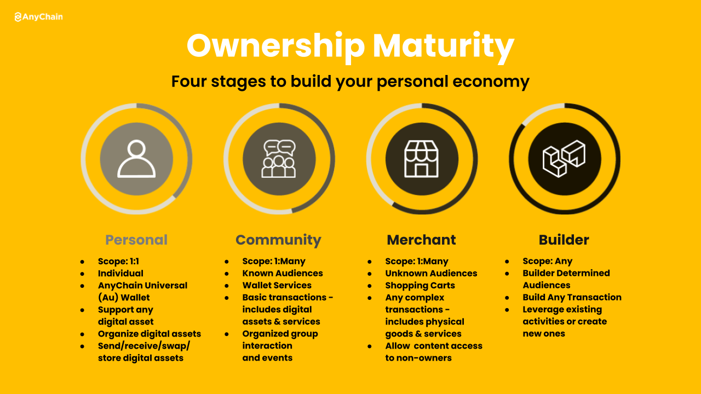

APEX High-Level Architecture 

APEX is designed as a decentralized and distributed system. APEX is meant to run in the cloud or on hardware owned and operated by the Owner. Every Owner could operate their own APEX environment with important data shared/replicated through a distributed hash table/chain. Alternatively, Owners may pay someone like AnyChain to host their APEX environment where common services are provided for all paying Owners without compromising on control and ownership.

**Figure 1:  AnyChain System Context**

APEX is a system that consists of 3 key components:

1. **_APEX UI_** - The AnyChain mobile or web user interface is not monolithic.  The frontend is to be implemented using autonomous microapps that are independently deployed. The objective of a micro frontend is to divide the user experience into a set of independent micro applications, while also providing users with a seamless experience. The main entry point will act as a metadata-driven assembly and menu system. This approach breaks the presentation tier into a set of independently deployable micro applications but stitches them back together for a seamless UX. As users move between different activities, it will not feel like they are jumping between applications. It feels like a single application.

> The **_APEX Universal Wallet_** (**_Au Wallet_**) is the standard AnyChain microapps implementation and the Owner’s primary interface to APEX.  It is a mobile application with built-in core functionality for creating an APEX account, authenticating an Owner as required and securing/backing up critical private keys/data. The Au Wallet also supports microapps that may be dynamically added as required to support desired functionality. Examples of microapps include an Owner’s feed, content creation, owner personalization, and more.

2. **_AnyChain Cloud Services (ACC)_** - This is where most of the heavy lifting for APEX is performed. ACC includes private storage of owner data, public storage of 1-to-many communications events (content sharing) in a distributed hash table/chain (DHT), serverless functions, blueprints for core functionality and blockchain nodes for desired operations. ACC is meant to be extensible as well, providing Owners with the ability to mesh new blockchains and other services with their other daily activities.

3. **_APEX Identity (AXI)_** - The AXI is an Owner’s proxy online. It only connects to a single Owner’s mobile device via the Au Wallet and it performs operations in the cloud at the Owner’s direction. AXI securely stores important Owner data so that it may be used during transactions and interactions as needed. This component may be operated as a container, VM, or physical appliance (e.g. installed on a Raspberry Pi or Atomic Pi) under the Owner’s direct control.

**Figure 2:  AnyChain High-Level Architecture**

APEX Owner

The Au Wallet is the Owner’s interface. It is a single place where an Owner can connect, communicate and transact with other Owners, blockchains and services. Core functionality like enrollment, authentication and administration make up the core of the Au Wallet, while other desired functionality is enabled dynamically using microapps.

**Figure 3:  AXI Identity Interactions**

APEX Identity represents the Owner, only connects with the Owner’s device and acts on their behalf. The AXI drives automation on behalf of the Owner and prompts the Owner for authorization anytime critical/protected data (e.g. private keys) are requested or required to perform an activity.

The ACC is how a single Owner’s Au Wallet and AXI connect with the rest of the world. This is where blockchains and other APEX services are deployed to support Owner’s activities. The goal for ACC is to provide serverless functions supporting activities (APIs) to operate or integrate with any blockchain or service the Owner desires.

All content (e.g. audio files, video files, portable web sites, etc.) is contained in blocks. Blocks are encrypted compressed archives that contain content and a manifest describing the contents for handling purposes. Blocks are shared with other Owners over IPFS

Owners have public profiles for discovering content and connecting with other Owners. Public profiles are blocks shared over IPFS and contain data the Owner is willing to share publicly. This data includes a name, age, location and public key at a minimum. Owners may personalize their profiles and advertise content they are sharing publicly or monetizing.

Owners wanting to communicate or transact must create a connection. The connection process creates a key exchange between the owners that is unique to the connection and regularly rotated. Connections are added to groups and group membership determines what content is shared with the connection. Owners can create more detailed connection profiles to share more information with their connections. Owners also have the option of sharing a contact block with specific connections creating an always up-to-date vCard.

Content shared with other Owners is placed in a content catalog. A content catalog is represented by a unique topic in an immutable distributed hash table/chain. The topic is composed of events containing a keyID, metadata about the post, and a pointer to a block hosted on IPFS. Owners may make content catalogs available for free or monetize them.

Monetization is done using APEX wallet services. Owners create wallets to control their digital assets. Public wallet addresses may be shared in profiles. External Owners create transactions to purchase or subscribe to monetized content. Payments are sent via any supported blockchain. Once the transaction hits the Owner’s wallet services, the transaction is processed by APEX Identity and the external Owner is added to the group associated with the content catalog purchased or subscribed to. External Owners receive receipts confirming purchases or subscriptions and facilitating content-specific key exchanges. 

Purchases and subscriptions allow owners to access the blocks associated with a specific content catalog. Once a block is shared, it will be available as long as a single copy exists somewhere on IPFS. New content published may use existing group keys or  new keys requiring a new purchase or updated subscription.

As **Figure 4** below indicates, everything is event driven. Events are always encrypted based on unique key exchanges with other connected Owners or services. Every Owner has public and private message slots where they receive events. The location of an Owner’s public and private message slots are publicly and privately shared via an ephemeral distributed hash table. Events are stored in object storage and have a type which defines how they should be handled.

When an event is received in an Owner’s message slot, serverless functions operate on the event and add it to the Owner’s feed. The Owner’s feed is a time-series based event queue containing all significant events for the Owner. The Owner’s feed is a super set and encompasses ALL events. The UI feed is a subset of the Owner’s feed containing events defining the blocks needed to support the Owner’s activities (microapps) in the Au Wallet. The content feed is a subset of the Owner feed that contains events defining all blocks of content meant for the owner.

The Vault offers Owners the ability to securely back up their critical keys and data contained in their Protean Credentials. Once an ACC administrator enables Vault access for the Owner, the Owner can elect to make a backup copy of their keys. To create a backup, the Owner authenticates their Protean Credential and creates a backup phrase unique to them. We recommend using song lyrics or movie quotes that are meaningful to you since most of us don’t perfectly memorize the words but will never forget our unique variations. The backup phrase is used to encrypt the Owner’s data and the resulting encrypted blob is stored in the Vault’s secure storage. To restore a backup, the Owner must ask an ACC administrator for access to the Vault, authenticate with their current credential, provide their backup phrase and then select the keys/data to be restored to their credential.

**Figure 4:  APEX UI-ACC-AXI  Interactions**

APEX Project Roadmap

The APEX project roadmap is built around the 4 stages of ownership maturity as identified by AnyChain. 

* **Phase 1**: **Personal Ownership** is about empowering people to organize, control and manage their personal digital assets, shared content and connections with others. 

* **Phase 2**: **Community Ownership** focuses on building communities with shared ownership (e.g. multisig wallets) and group events/interactions. 

* **Phase 3**: **Merchant Ownership** focuses on more complicated transactions between Owners and other Owners, services and non-owners (e.g. no APEX account). 

* **Phase 4**: **Builder Ownership** is where an Owner can build new experiences that are integrated with APEX and deployable by other Owners. Overall, the APEX roadmap is aligned with adding functionality to assist an Owner in growing their personal economy.

AnyChain has identified simple use cases that map to the stages of Ownership. These stages provide a general guide for prioritizing new functionality in upcoming releases. Each stage is built around a theme which should guide development. Stage 1 is all about helping an individual to get their digital life in order. With stage 2 APEX focuses on organizing and managing group interactions. The third stage is meant to support Owners who are building their business using APEX services. And the final stage is meant for Owners who have a vision or expertise they would like to share with others in order to deliver new experiences.

<table>
  <tr>
    <td>Use Case Sequences</td>
    <td></td>
    <td></td>
    <td></td>
  </tr>
  <tr>
    <td>Personal</td>
    <td>Community</td>
    <td>Merchant</td>
    <td>Builder</td>
  </tr>
  <tr>
    <td>Manage personal digital assets (crypto, NFT, etc.)</td>
    <td>Create and manage public and private group conversations via channels</td>
    <td>Online and in-person shopping for physical goods including inventory, shopping carts, and shipping</td>
    <td>Integrate new blockchains with APEX including activities and guides</td>
  </tr>
  <tr>
    <td>Create an online identity and connect with others.</td>
    <td>Create and manage events including scheduling and ticketing</td>
    <td>Management for in-person or virtual services including scheduling, timekeeping and invoicing</td>
    <td>Offer new experiences to Owners with custom services integrated with APEX</td>
  </tr>
  <tr>
    <td>Share content with 1 or more people (e.g. text, audio, video, microsite)</td>
    <td>Manage group digital assets (multisig wallets)</td>
    <td></td>
    <td></td>
  </tr>
  <tr>
    <td>Monetize content with one time purchases or subscriptions</td>
    <td></td>
    <td></td>
    <td></td>
  </tr>
</table>

<table style="background-color:#FFFFE0;color:black;">
<tr style="background-color:#BDB76B;color:white;">
<th>Table Header</th><th>Table Header</th>
</tr>
<tr>
<td>Table cell 1</td><td>Table cell 2</td>
</tr>
<tr>
<td>Table cell 3</td><td>Table cell 4</td>
</tr>
</table>

